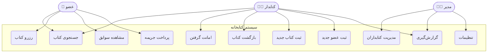
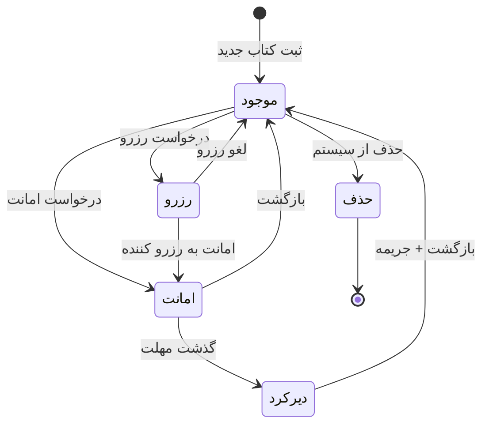
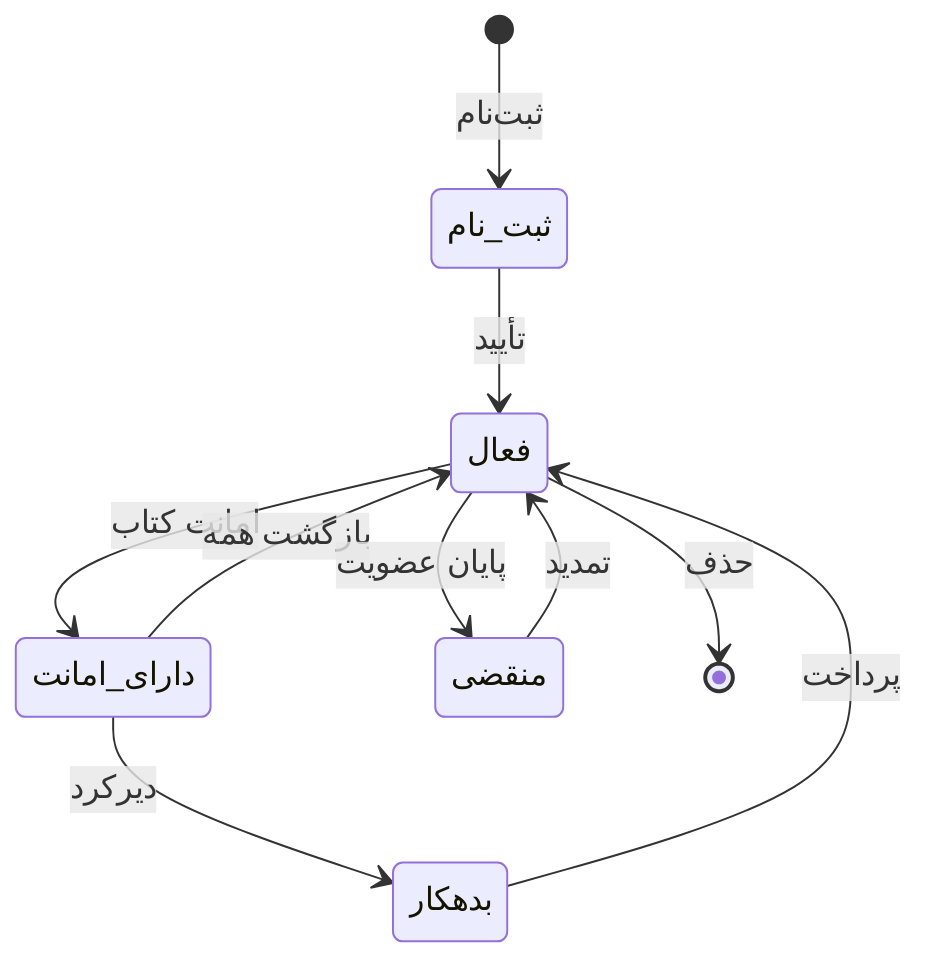
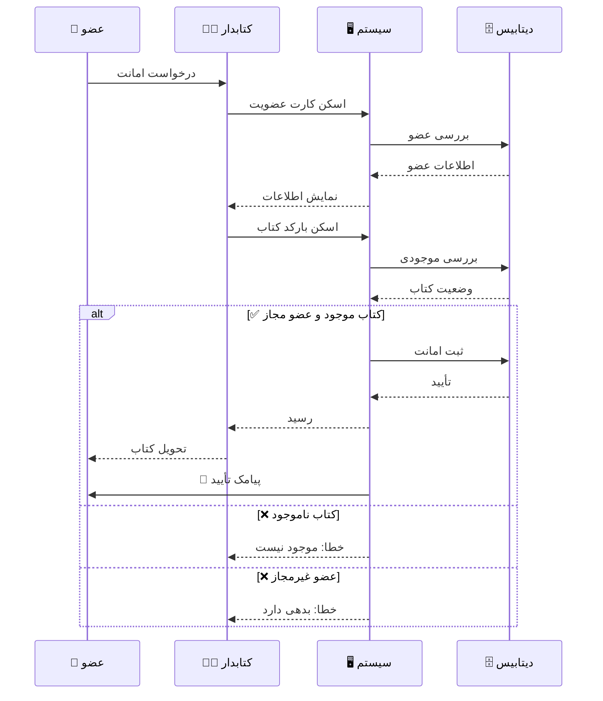
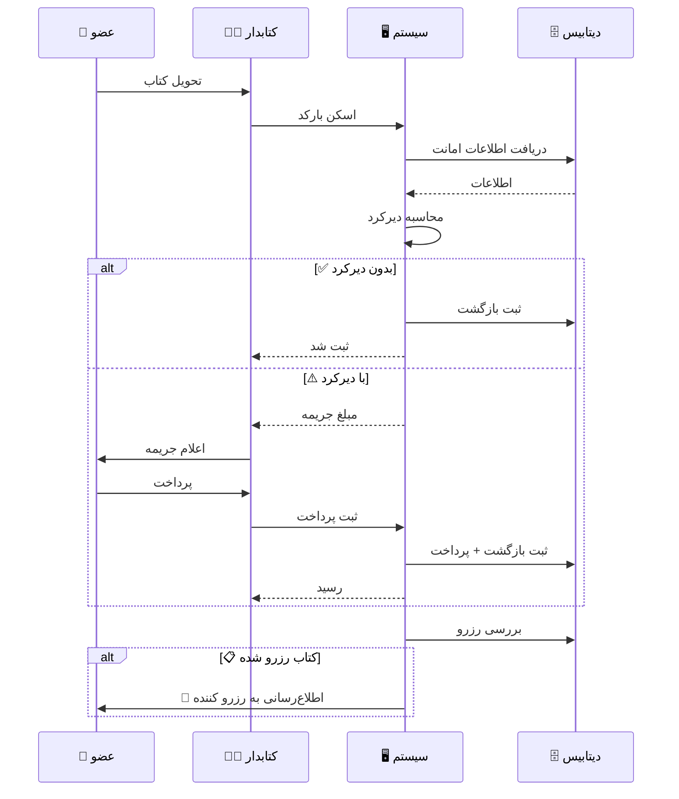
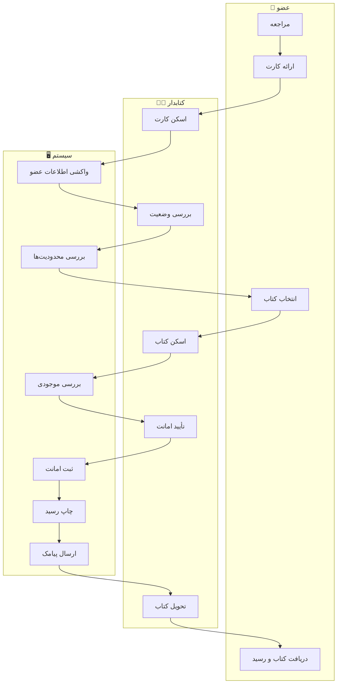
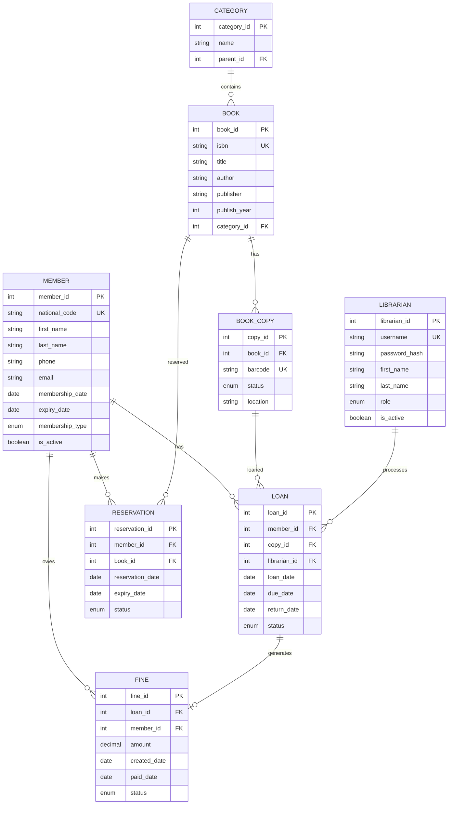
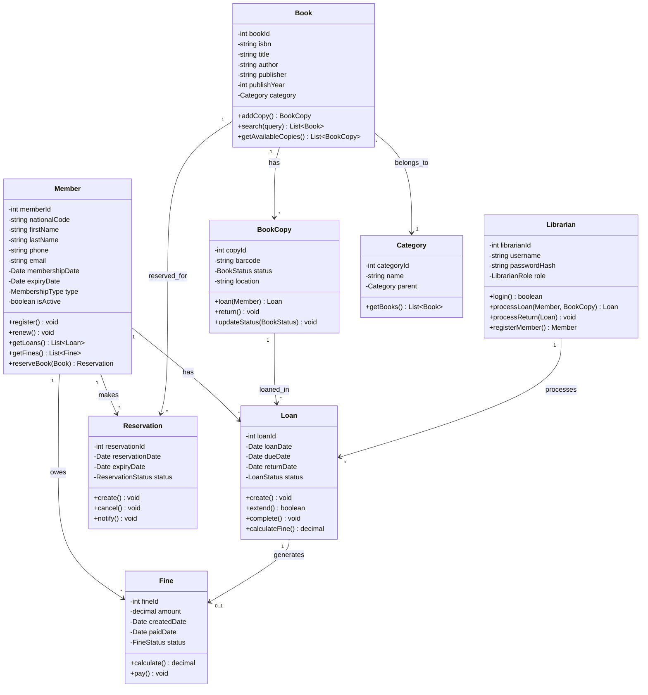

<div align="center">

# 📚 سیستم مدیریت و امانت‌دهی کتابخانه
### گزارش پروژه درس تحلیل و طراحی سیستم‌ها

**دانشجو:** ایمان میرعظیمی

</div>

---

## 📋 فهرست مطالب

- [مقدمه](#-مقدمه)
- [اجزای اصلی سیستم](#-اجزای-اصلی-سیستم)
- [گردش کار کاربران](#-گردش-کار-کاربران)
- [سناریوها](#-سناریوها)
- [نمودارها](#-نمودارها)
  - [Use Case Diagram](#use-case-diagram)
  - [State Diagrams](#state-diagrams)
  - [Sequence Diagrams](#sequence-diagrams)
  - [Activity Diagrams](#activity-diagrams)
  - [Swimlane Diagram](#swimlane-diagram)
  - [ER Diagram](#er-diagram)
  - [Class Diagram](#class-diagram)

---

## 📖 مقدمه

سیستم‌های اطلاعاتی برای کتابخانه‌ها اهمیت بسیاری دارند. این پروژه یک سیستم جامع مدیریت کتابخانه را طراحی می‌کند که شامل امانت‌دهی، مدیریت اعضا، و گزارش‌گیری است.

### اهمیت سیستم

| ویژگی | توضیح |
|-------|-------|
| **مدیریت عملیات روزانه** | مدیریت امانت‌دهی، موجودی کتاب‌ها، عضویت کاربران |
| **افزایش کارایی** | جستجوی آنلاین، خودکارسازی ثبت امانت و بازگشت |
| **مدیریت موجودی** | کنترل دقیق موجودی کتاب‌ها |
| **ارتباط با اعضا** | ذخیره اطلاعات، سوابق امانت، ترجیحات |
| **مدیریت جریمه** | محاسبه خودکار جریمه دیرکرد |
| **گزارش‌گیری** | آمار امانت، کتاب‌های پرطرفدار، عملکرد |

---

## 🔧 اجزای اصلی سیستم

### ۱. مدیریت کتاب‌ها
- ثبت کتاب جدید (عنوان، نویسنده، ناشر، شابک، دسته‌بندی)
- ویرایش و حذف کتاب
- جستجوی پیشرفته
- مدیریت نسخه‌های فیزیکی

### ۲. مدیریت اعضا
- ثبت‌نام عضو جدید
- تمدید عضویت
- مشاهده سوابق امانت
- مدیریت سطوح عضویت (دانشجو، استاد، عمومی)

### ۳. سیستم امانت‌دهی
- ثبت امانت کتاب
- محاسبه خودکار تاریخ بازگشت
- امکان تمدید امانت
- ثبت بازگشت کتاب

### ۴. سیستم رزرو
- رزرو کتاب‌های در حال امانت
- اطلاع‌رسانی پس از بازگشت
- لغو رزرو

### ۵. مدیریت جریمه
- محاسبه خودکار جریمه دیرکرد
- ثبت پرداخت
- گزارش بدهی اعضا

### ۶. گزارش‌گیری
- گزارش امانت‌های روزانه/ماهانه
- کتاب‌های پرطرفدار
- اعضای فعال
- کتاب‌های دیرکرد‌دار

---

## 👥 گردش کار کاربران

### عضو کتابخانه
```
ثبت‌نام ← ورود ← جستجوی کتاب ← مشاهده وضعیت ← رزرو/امانت ← پیگیری ← بازگشت
```

### کتابدار
```
ورود ← ثبت امانت ← ثبت بازگشت ← ثبت کتاب جدید ← ثبت عضو ← دریافت جریمه ← گزارش‌گیری
```

### مدیر سیستم
```
مدیریت کتابداران ← تنظیمات سیستم ← گزارش‌های کلان ← پشتیبان‌گیری
```

---

## 📝 سناریوها

### سناریو ۱: امانت گرفتن کتاب

<details>
<summary>🔽 کلیک برای مشاهده جزئیات</summary>

#### پیش‌شرط
- عضو ثبت‌نام کرده باشد
- عضویت فعال باشد
- بدهی معوق نداشته باشد

#### مراحل
1. عضو به کتابخانه مراجعه می‌کند
2. کتاب مورد نظر را انتخاب می‌کند
3. کتابدار کارت عضویت را اسکن می‌کند
4. سیستم اطلاعات عضو را نمایش می‌دهد
5. کتابدار بارکد کتاب را اسکن می‌کند
6. سیستم بررسی می‌کند:
   - آیا کتاب موجود است؟
   - آیا عضو به سقف امانت نرسیده؟
   - آیا عضو جریمه معوق ندارد؟
7. در صورت تأیید، امانت ثبت می‌شود
8. رسید امانت چاپ می‌شود
9. پیامک تأیید ارسال می‌شود

#### پس‌شرط
- موجودی کتاب کاهش می‌یابد
- رکورد امانت ثبت می‌شود

</details>

---

### سناریو ۲: بازگشت کتاب

<details>
<summary>🔽 کلیک برای مشاهده جزئیات</summary>

#### پیش‌شرط
- کتاب قبلاً امانت داده شده باشد

#### مراحل
1. عضو کتاب را برمی‌گرداند
2. کتابدار بارکد کتاب را اسکن می‌کند
3. سیستم اطلاعات امانت را نمایش می‌دهد
4. بررسی دیرکرد:
   - اگر تاریخ گذشته → جریمه محاسبه می‌شود
5. در صورت جریمه:
   - مبلغ نمایش داده می‌شود
   - عضو پرداخت می‌کند
   - رسید صادر می‌شود
6. بازگشت ثبت می‌شود
7. اگر رزرو شده → اطلاع‌رسانی به عضو بعدی

#### پس‌شرط
- موجودی کتاب افزایش می‌یابد
- رکورد امانت بسته می‌شود

</details>

---

### سناریو ۳: رزرو کتاب

<details>
<summary>🔽 کلیک برای مشاهده جزئیات</summary>

#### پیش‌شرط
- کتاب در حال امانت باشد
- عضو ثبت‌نام کرده باشد

#### مراحل
1. عضو کتاب را جستجو می‌کند
2. سیستم: کتاب موجود نیست
3. عضو «رزرو» را انتخاب می‌کند
4. بررسی سیستم:
   - آیا قبلاً رزرو نکرده؟
   - آیا صف پر نشده؟
5. رزرو ثبت می‌شود
6. پس از بازگشت کتاب → اطلاع‌رسانی
7. ۴۸ ساعت فرصت امانت

#### پس‌شرط
- رکورد رزرو ثبت می‌شود

</details>

---

## 📊 نمودارها

### Use Case Diagram



---

### State Diagrams

#### وضعیت کتاب



#### وضعیت عضو



---

### Sequence Diagrams

#### فرآیند امانت کتاب



#### فرآیند بازگشت کتاب



---

### Activity Diagrams

#### فرآیند امانت


#### فرآیند پرداخت جریمه


---

### Swimlane Diagram



---

### ER Diagram



---

### Class Diagram



---

## 📌 جمع‌بندی

این سیستم مدیریت کتابخانه شامل تمام قابلیت‌های لازم برای:

✅ مدیریت کتاب‌ها و موجودی  
✅ مدیریت اعضا و عضویت  
✅ امانت‌دهی و بازگشت  
✅ رزرو کتاب  
✅ مدیریت جریمه‌ها  
✅ گزارش‌گیری جامع

### مزایای پیاده‌سازی

| مزیت | توضیح |
|------|-------|
| 🚀 افزایش سرعت | خدمت‌دهی سریع‌تر به اعضا |
| 📉 کاهش خطا | حذف خطاهای انسانی |
| 📊 گزارش‌گیری | تصمیم‌گیری بهتر با داده |
| 😊 رضایت | تجربه بهتر برای اعضا |

---

<div align="center">

**📚 پایان گزارش**

</div>

