

# 📚 سیستم مدیریت و امانت‌دهی کتابخانه
### گزارش پروژه درس تحلیل و طراحی سیستم‌ها

**دانشجو:** ایمان میرعظیمی

---

## 📋 فهرست مطالب

- [مقدمه](#-مقدمه)
- [اجزای اصلی سیستم](#-اجزای-اصلی-سیستم)
- [گردش کار کاربران](#-گردش-کار-کاربران)
- [سناریوها (Use Case Scenarios)](#-سناریوها-use-case-scenarios)
  - [سناریو ۱: امانت گرفتن کتاب](#سناریو-۱-امانت-گرفتن-کتاب)
  - [سناریو ۲: بازگشت کتاب](#سناریو-۲-بازگشت-کتاب)
  - [سناریو ۳: رزرو کتاب](#سناریو-۳-رزرو-کتاب)
  - [سناریو ۴: ثبت‌نام عضو جدید](#سناریو-۴-ثبتنام-عضو-جدید)
  - [سناریو ۵: پرداخت جریمه](#سناریو-۵-پرداخت-جریمه)
  - [سناریو ۶: تمدید امانت](#سناریو-۶-تمدید-امانت)
- [نمودارها](#-نمودارها)
  - [DFD Level 0 (Context Diagram)](#dfd-level-0-context-diagram)
  - [DFD Level 1](#dfd-level-1)
  - [DFD Level 1 - Detailed](#dfd-level-1---detailed-نمای-تفصیلی)
  - [Use Case Diagram (Complete)](#use-case-diagram-complete)
  - [Use Case Diagram - Alternative View](#use-case-diagram---alternative-view-نمای-جایگزین)
  - [جدول توصیف Use Caseها](#جدول-توصیف-use-caseها)
  - [State Diagrams](#state-diagrams)
  - [Sequence Diagrams](#sequence-diagrams)
  - [Activity Diagrams](#activity-diagrams)
  - [Swimlane Diagram](#swimlane-diagram)
  - [ER Diagram](#er-diagram)
  - [Class Diagram](#class-diagram)
- [کارت‌های CRC](#-کارتهای-crc-class-responsibility-collaboration)

---

## 📖 مقدمه

سیستم‌های اطلاعاتی برای کتابخانه‌ها اهمیت بسیاری دارند. این پروژه یک سیستم جامع مدیریت کتابخانه را طراحی می‌کند که شامل امانت‌دهی، مدیریت اعضا، و گزارش‌گیری است.

### اهمیت سیستم

| ویژگی | توضیح |
|-------|-------|
| **مدیریت عملیات روزانه** | مدیریت امانت‌دهی، موجودی کتاب‌ها، عضویت کاربران |
| **افزایش کارایی** | جستجوی آنلاین، خودکارسازی ثبت امانت و بازگشت |
| **مدیریت موجودی** | کنترل دقیق موجودی کتاب‌ها |
| **ارتباط با اعضا** | ذخیره اطلاعات، سوابق امانت، ترجیحات |
| **مدیریت جریمه** | محاسبه خودکار جریمه دیرکرد |
| **گزارش‌گیری** | آمار امانت، کتاب‌های پرطرفدار، عملکرد |

---

## 🔧 اجزای اصلی سیستم

### ۱. مدیریت کتاب‌ها
- ثبت کتاب جدید (عنوان، نویسنده، ناشر، شابک، دسته‌بندی)
- ویرایش و حذف کتاب
- جستجوی پیشرفته
- مدیریت نسخه‌های فیزیکی

### ۲. مدیریت اعضا
- ثبت‌نام عضو جدید
- تمدید عضویت
- مشاهده سوابق امانت
- مدیریت سطوح عضویت (دانشجو، استاد، عمومی)

### ۳. سیستم امانت‌دهی
- ثبت امانت کتاب
- محاسبه خودکار تاریخ بازگشت
- امکان تمدید امانت
- ثبت بازگشت کتاب

### ۴. سیستم رزرو
- رزرو کتاب‌های در حال امانت
- اطلاع‌رسانی پس از بازگشت
- لغو رزرو

### ۵. مدیریت جریمه
- محاسبه خودکار جریمه دیرکرد
- ثبت پرداخت
- گزارش بدهی اعضا

### ۶. گزارش‌گیری
- گزارش امانت‌های روزانه/ماهانه
- کتاب‌های پرطرفدار
- اعضای فعال
- کتاب‌های دیرکرد‌دار

---

## 👥 گردش کار کاربران

### نمودار گردش کار کلی سیستم

```mermaid
flowchart TD
    subgraph MemberFlow["🧑 گردش کار عضو"]
        M1([شروع]) --> M2{عضو است؟}
        M2 -->|خیر| M3[ثبت‌نام]
        M3 --> M4[دریافت کارت عضویت]
        M4 --> M5[ورود به سیستم]
        M2 -->|بله| M5
        M5 --> M6[جستجوی کتاب]
        M6 --> M7{کتاب موجود؟}
        M7 -->|بله| M8[مراجعه به کتابخانه]
        M8 --> M9[امانت گرفتن]
        M9 --> M10[مطالعه]
        M10 --> M11[بازگشت کتاب]
        M7 -->|خیر| M12[رزرو کتاب]
        M12 --> M13[انتظار اطلاع‌رسانی]
        M13 --> M8
        M11 --> M14{جریمه دارد؟}
        M14 -->|بله| M15[پرداخت جریمه]
        M15 --> M16([پایان])
        M14 -->|خیر| M16
    end
```

```mermaid
flowchart TD
    subgraph LibrarianFlow["👨‍💼 گردش کار کتابدار"]
        L1([شروع شیفت]) --> L2[ورود به سیستم]
        L2 --> L3{نوع درخواست؟}
        
        L3 -->|امانت| L4[اسکن کارت عضو]
        L4 --> L5[بررسی وضعیت عضو]
        L5 --> L6{مجاز؟}
        L6 -->|بله| L7[اسکن کتاب]
        L7 --> L8[ثبت امانت]
        L8 --> L9[صدور رسید]
        L6 -->|خیر| L10[اعلام مشکل]
        
        L3 -->|بازگشت| L11[اسکن کتاب]
        L11 --> L12[بررسی دیرکرد]
        L12 --> L13{دیرکرد؟}
        L13 -->|بله| L14[محاسبه جریمه]
        L14 --> L15[دریافت وجه]
        L15 --> L16[ثبت بازگشت]
        L13 -->|خیر| L16
        
        L3 -->|ثبت کتاب| L17[ورود اطلاعات کتاب]
        L17 --> L18[ثبت نسخه‌ها]
        L18 --> L19[تأیید ثبت]
        
        L3 -->|ثبت عضو| L20[دریافت مدارک]
        L20 --> L21[ورود اطلاعات]
        L21 --> L22[صدور کارت]
        
        L9 --> L23([ادامه کار])
        L10 --> L23
        L16 --> L23
        L19 --> L23
        L22 --> L23
    end
```

```mermaid
flowchart TD
    subgraph AdminFlow["👨‍💻 گردش کار مدیر"]
        A1([شروع]) --> A2[ورود به پنل مدیریت]
        A2 --> A3{نوع کار؟}
        
        A3 -->|مدیریت کارکنان| A4[مشاهده لیست کتابداران]
        A4 --> A5{عملیات؟}
        A5 -->|افزودن| A6[ثبت کتابدار جدید]
        A5 -->|ویرایش| A7[ویرایش اطلاعات]
        A5 -->|حذف| A8[غیرفعال کردن]
        
        A3 -->|گزارش‌گیری| A9[انتخاب نوع گزارش]
        A9 --> A10[تنظیم فیلترها]
        A10 --> A11[تولید گزارش]
        A11 --> A12[دانلود/چاپ]
        
        A3 -->|تنظیمات| A13[تنظیمات سیستم]
        A13 --> A14[ذخیره تغییرات]
        
        A3 -->|پشتیبان‌گیری| A15[ایجاد نسخه پشتیبان]
        A15 --> A16[ذخیره در سرور]
        
        A6 --> A17([پایان])
        A7 --> A17
        A8 --> A17
        A12 --> A17
        A14 --> A17
        A16 --> A17
    end
```

### خلاصه گردش کار

| نقش | مراحل کلیدی |
|-----|-------------|
| **عضو** | ثبت‌نام ← ورود ← جستجو ← رزرو/امانت ← بازگشت ← پرداخت جریمه |
| **کتابدار** | ورود ← ثبت امانت ← ثبت بازگشت ← ثبت کتاب ← ثبت عضو ← گزارش |
| **مدیر** | مدیریت کتابداران ← تنظیمات ← گزارش‌های کلان ← پشتیبان‌گیری |

---

## 📝 سناریوها (Use Case Scenarios)

> هر سناریو شامل مسیر موفق (Main Success Scenario) و مسیرهای ناموفق (Extensions) است.

---

### سناریو ۱: امانت گرفتن کتاب

🔽 کلیک برای مشاهده جزئیات

| مشخصه | توضیح |
|-------|-------|
| **شناسه** | UC-01 |
| **نام** | امانت گرفتن کتاب |
| **بازیگر اصلی** | کتابدار |
| **بازیگران فرعی** | عضو، سیستم پیامک |
| **هدف** | ثبت امانت کتاب برای عضو |

#### پیش‌شرط
- عضو ثبت‌نام کرده و عضویت فعال دارد
- کتابدار وارد سیستم شده است

#### ✅ سناریوی موفق (Main Success Scenario)

| مرحله | بازیگر | عمل |
|-------|--------|-----|
| 1 | عضو | به کتابخانه مراجعه و کتاب را انتخاب می‌کند |
| 2 | کتابدار | کارت عضویت را اسکن می‌کند |
| 3 | سیستم | اطلاعات عضو را نمایش می‌دهد (نام، تعداد امانت فعلی، وضعیت) |
| 4 | کتابدار | بارکد کتاب را اسکن می‌کند |
| 5 | سیستم | موجودی و وضعیت کتاب را بررسی می‌کند |
| 6 | سیستم | سقف امانت و بدهی عضو را بررسی می‌کند |
| 7 | سیستم | امانت را ثبت و تاریخ بازگشت را محاسبه می‌کند |
| 8 | سیستم | رسید امانت را چاپ می‌کند |
| 9 | سیستم | پیامک تأیید به عضو ارسال می‌کند |
| 10 | کتابدار | کتاب و رسید را به عضو تحویل می‌دهد |

#### ❌ سناریوهای ناموفق (Extensions)

| شماره | شرط | عمل |
|-------|-----|-----|
| 3a | عضویت منقضی شده | سیستم پیام خطا نمایش می‌دهد → کتابدار درخواست تمدید عضویت می‌کند |
| 5a | کتاب موجود نیست | سیستم پیشنهاد رزرو می‌دهد → عضو می‌تواند رزرو کند |
| 6a | عضو به سقف امانت رسیده | سیستم خطا: "سقف امانت پر است" → عملیات لغو می‌شود |
| 6b | عضو جریمه معوق دارد | سیستم خطا: "ابتدا جریمه را پرداخت کنید" → هدایت به پرداخت |
| 9a | خطا در ارسال پیامک | سیستم در لاگ ثبت می‌کند → امانت ادامه می‌یابد |

#### پس‌شرط
- ✅ موجودی نسخه کاهش می‌یابد
- ✅ رکورد امانت ایجاد می‌شود
- ✅ تعداد امانت فعال عضو افزایش می‌یابد

---

### سناریو ۲: بازگشت کتاب

🔽 کلیک برای مشاهده جزئیات

| مشخصه | توضیح |
|-------|-------|
| **شناسه** | UC-02 |
| **نام** | بازگشت کتاب |
| **بازیگر اصلی** | کتابدار |
| **بازیگران فرعی** | عضو، سیستم پیامک |
| **هدف** | ثبت بازگشت کتاب و محاسبه جریمه احتمالی |

#### پیش‌شرط
- کتاب قبلاً امانت داده شده باشد
- کتابدار وارد سیستم شده است

#### ✅ سناریوی موفق (Main Success Scenario)

| مرحله | بازیگر | عمل |
|-------|--------|-----|
| 1 | عضو | کتاب را به کتابخانه برمی‌گرداند |
| 2 | کتابدار | بارکد کتاب را اسکن می‌کند |
| 3 | سیستم | اطلاعات امانت را نمایش می‌دهد (تاریخ امانت، تاریخ سررسید) |
| 4 | سیستم | تاریخ بازگشت را با سررسید مقایسه می‌کند |
| 5 | سیستم | بازگشت به موقع → بدون جریمه |
| 6 | سیستم | وضعیت امانت را "بازگشت داده شده" می‌کند |
| 7 | سیستم | موجودی نسخه را افزایش می‌دهد |
| 8 | سیستم | رسید بازگشت صادر می‌کند |

#### ❌ سناریوهای ناموفق (Extensions)

| شماره | شرط | عمل |
|-------|-----|-----|
| 2a | بارکد خوانده نمی‌شود | کتابدار شماره را دستی وارد می‌کند |
| 3a | امانتی برای این کتاب یافت نشد | سیستم خطا نمایش می‌دهد → بررسی دستی |
| 5a | کتاب با دیرکرد برگردانده شده | سیستم جریمه محاسبه می‌کند → رفتن به سناریوی پرداخت جریمه |
| 5b | کتاب آسیب دیده | کتابدار خسارت را ثبت می‌کند → محاسبه جریمه خسارت |
| 7a | کتاب رزرو شده بوده | سیستم به رزرو کننده پیامک ارسال می‌کند |

#### پس‌شرط
- ✅ موجودی نسخه افزایش می‌یابد
- ✅ وضعیت امانت بسته می‌شود
- ✅ در صورت رزرو، اطلاع‌رسانی انجام می‌شود

---

### سناریو ۳: رزرو کتاب

🔽 کلیک برای مشاهده جزئیات

| مشخصه | توضیح |
|-------|-------|
| **شناسه** | UC-03 |
| **نام** | رزرو کتاب |
| **بازیگر اصلی** | عضو |
| **بازیگران فرعی** | سیستم پیامک |
| **هدف** | رزرو کتاب ناموجود برای امانت آینده |

#### پیش‌شرط
- عضو وارد سیستم شده است
- کتاب در حال حاضر موجود نیست (در امانت است)

#### ✅ سناریوی موفق (Main Success Scenario)

| مرحله | بازیگر | عمل |
|-------|--------|-----|
| 1 | عضو | کتاب مورد نظر را جستجو می‌کند |
| 2 | سیستم | نتایج را نمایش می‌دهد: "کتاب در امانت است" |
| 3 | عضو | دکمه "رزرو" را کلیک می‌کند |
| 4 | سیستم | بررسی می‌کند که عضو قبلاً این کتاب را رزرو نکرده |
| 5 | سیستم | بررسی می‌کند که صف رزرو پر نشده (حداکثر ۳ نفر) |
| 6 | سیستم | رزرو را ثبت می‌کند |
| 7 | سیستم | تأییدیه رزرو به عضو نمایش می‌دهد |
| 8 | سیستم | پیامک تأیید ارسال می‌کند |

#### ❌ سناریوهای ناموفق (Extensions)

| شماره | شرط | عمل |
|-------|-----|-----|
| 2a | کتاب موجود است | سیستم پیشنهاد امانت می‌دهد → رزرو لازم نیست |
| 4a | عضو قبلاً رزرو کرده | سیستم خطا: "شما قبلاً این کتاب را رزرو کرده‌اید" |
| 5a | صف رزرو پر است | سیستم خطا: "صف رزرو پر است، لطفاً بعداً تلاش کنید" |
| 6a | عضویت منقضی | سیستم خطا: "ابتدا عضویت را تمدید کنید" |
| 8a | کتاب برگردانده شد | سیستم پیامک "کتاب آماده است" ارسال می‌کند → ۴۸ ساعت فرصت |
| 8b | ۴۸ ساعت گذشت و مراجعه نکرد | رزرو لغو → نفر بعدی مطلع می‌شود |

#### پس‌شرط
- ✅ رکورد رزرو ایجاد می‌شود
- ✅ عضو در صف رزرو قرار می‌گیرد

---

### سناریو ۴: ثبت‌نام عضو جدید

🔽 کلیک برای مشاهده جزئیات

| مشخصه | توضیح |
|-------|-------|
| **شناسه** | UC-04 |
| **نام** | ثبت‌نام عضو جدید |
| **بازیگر اصلی** | کتابدار |
| **بازیگران فرعی** | متقاضی عضویت |
| **هدف** | ثبت عضو جدید در سیستم کتابخانه |

#### پیش‌شرط
- کتابدار وارد سیستم شده است
- متقاضی مدارک لازم را ارائه داده است

#### ✅ سناریوی موفق (Main Success Scenario)

| مرحله | بازیگر | عمل |
|-------|--------|-----|
| 1 | متقاضی | مدارک شناسایی را ارائه می‌دهد |
| 2 | کتابدار | فرم ثبت‌نام را باز می‌کند |
| 3 | کتابدار | اطلاعات شخصی را وارد می‌کند (نام، کد ملی، تلفن، ایمیل) |
| 4 | سیستم | کد ملی را بررسی می‌کند (تکراری نباشد) |
| 5 | کتابدار | نوع عضویت را انتخاب می‌کند (دانشجو/استاد/عمومی) |
| 6 | سیستم | مبلغ عضویت را محاسبه می‌کند |
| 7 | کتابدار | حق عضویت را دریافت می‌کند |
| 8 | سیستم | عضو را ثبت و شماره عضویت صادر می‌کند |
| 9 | سیستم | کارت عضویت را چاپ می‌کند |
| 10 | کتابدار | کارت را به عضو تحویل می‌دهد |
| 11 | سیستم | پیامک خوش‌آمدگویی ارسال می‌کند |

#### ❌ سناریوهای ناموفق (Extensions)

| شماره | شرط | عمل |
|-------|-----|-----|
| 3a | اطلاعات ناقص است | سیستم فیلدهای اجباری را مشخص می‌کند |
| 4a | کد ملی تکراری است | سیستم خطا: "این فرد قبلاً عضو شده است" → نمایش اطلاعات قبلی |
| 4b | فرمت کد ملی نامعتبر | سیستم خطا: "کد ملی نامعتبر است" |
| 7a | متقاضی توان پرداخت ندارد | عملیات لغو می‌شود → اطلاعات ذخیره نمی‌شود |
| 9a | پرینتر خراب است | کتابدار کارت را بعداً چاپ می‌کند → شماره عضویت دستی داده می‌شود |

#### پس‌شرط
- ✅ رکورد عضو ایجاد می‌شود
- ✅ کارت عضویت صادر می‌شود
- ✅ عضو می‌تواند کتاب امانت بگیرد

---

### سناریو ۵: پرداخت جریمه

🔽 کلیک برای مشاهده جزئیات

| مشخصه | توضیح |
|-------|-------|
| **شناسه** | UC-05 |
| **نام** | پرداخت جریمه دیرکرد |
| **بازیگر اصلی** | عضو |
| **بازیگران فرعی** | کتابدار |
| **هدف** | پرداخت بدهی جریمه و رفع محدودیت امانت |

#### پیش‌شرط
- عضو جریمه معوق دارد
- کتابدار وارد سیستم شده است

#### ✅ سناریوی موفق (Main Success Scenario)

| مرحله | بازیگر | عمل |
|-------|--------|-----|
| 1 | عضو | به کتابخانه مراجعه می‌کند |
| 2 | کتابدار | کارت عضویت را اسکن می‌کند |
| 3 | سیستم | لیست جریمه‌های معوق را نمایش می‌دهد |
| 4 | سیستم | جمع کل بدهی را محاسبه می‌کند |
| 5 | عضو | تصمیم به پرداخت کامل می‌گیرد |
| 6 | کتابدار | مبلغ را دریافت می‌کند |
| 7 | کتابدار | پرداخت را در سیستم ثبت می‌کند |
| 8 | سیستم | وضعیت جریمه‌ها را "پرداخت شده" می‌کند |
| 9 | سیستم | محدودیت امانت عضو را برمی‌دارد |
| 10 | سیستم | رسید پرداخت صادر می‌کند |

#### ❌ سناریوهای ناموفق (Extensions)

| شماره | شرط | عمل |
|-------|-----|-----|
| 3a | جریمه‌ای وجود ندارد | سیستم پیام: "بدهی ندارید" → پایان |
| 5a | عضو فقط بخشی را پرداخت می‌کند | سیستم پرداخت جزئی را ثبت می‌کند → بدهی باقی‌مانده نمایش داده می‌شود |
| 5b | عضو درخواست بخشش دارد | کتابدار با مدیر هماهنگ می‌کند → در صورت تأیید، بخشش ثبت می‌شود |
| 6a | عضو پول کافی ندارد | عملیات لغو → جریمه باقی می‌ماند |
| 9a | پس از پرداخت هنوز محدودیت هست | بررسی دستی توسط کتابدار |

#### پس‌شرط
- ✅ جریمه‌ها پرداخت شده ثبت می‌شوند
- ✅ عضو می‌تواند مجدداً کتاب امانت بگیرد
- ✅ رسید پرداخت صادر می‌شود

---

### سناریو ۶: تمدید امانت

🔽 کلیک برای مشاهده جزئیات

| مشخصه | توضیح |
|-------|-------|
| **شناسه** | UC-06 |
| **نام** | تمدید مهلت امانت |
| **بازیگر اصلی** | کتابدار |
| **بازیگران فرعی** | عضو |
| **هدف** | افزایش مهلت بازگشت کتاب |

#### پیش‌شرط
- امانت فعال وجود دارد
- مهلت امانت هنوز تمام نشده

#### ✅ سناریوی موفق (Main Success Scenario)

| مرحله | بازیگر | عمل |
|-------|--------|-----|
| 1 | عضو | درخواست تمدید می‌دهد (حضوری/تلفنی/آنلاین) |
| 2 | کتابدار | اطلاعات امانت را جستجو می‌کند |
| 3 | سیستم | اطلاعات امانت را نمایش می‌دهد |
| 4 | سیستم | بررسی می‌کند که کتاب رزرو نشده باشد |
| 5 | سیستم | بررسی می‌کند که تعداد تمدید به حد نرسیده (حداکثر ۲ بار) |
| 6 | کتابدار | تمدید را تأیید می‌کند |
| 7 | سیستم | تاریخ سررسید را ۱۴ روز جلو می‌برد |
| 8 | سیستم | تعداد تمدید را افزایش می‌دهد |
| 9 | سیستم | پیامک تأیید تمدید ارسال می‌کند |

#### ❌ سناریوهای ناموفق (Extensions)

| شماره | شرط | عمل |
|-------|-----|-----|
| 2a | امانتی یافت نشد | سیستم خطا: "امانت فعالی وجود ندارد" |
| 4a | کتاب رزرو شده است | سیستم خطا: "امکان تمدید نیست - کتاب رزرو شده" |
| 5a | سقف تمدید پر شده | سیستم خطا: "شما ۲ بار تمدید کرده‌اید - لطفاً کتاب را برگردانید" |
| 5b | کتاب دیرکرد دارد | سیستم خطا: "ابتدا جریمه دیرکرد را پرداخت کنید" |
| 6a | کتابدار تمدید را رد می‌کند | دلیل ثبت می‌شود → عضو مطلع می‌شود |

#### پس‌شرط
- ✅ تاریخ سررسید به‌روزرسانی می‌شود
- ✅ تعداد تمدید افزایش می‌یابد
- ✅ عضو مهلت بیشتری دارد

---

### جدول خلاصه سناریوها

| # | سناریو | بازیگر اصلی | مسیر موفق | مسیرهای ناموفق |
|---|--------|-------------|-----------|----------------|
| 1 | امانت کتاب | کتابدار | ثبت امانت + رسید + پیامک | عضویت منقضی، سقف پر، جریمه دارد |
| 2 | بازگشت کتاب | کتابدار | ثبت بازگشت + افزایش موجودی | دیرکرد، کتاب آسیب‌دیده |
| 3 | رزرو کتاب | عضو | ثبت رزرو + پیامک | قبلاً رزرو کرده، صف پر |
| 4 | ثبت عضو | کتابدار | صدور کارت + پیامک | کد ملی تکراری، پرداخت ناموفق |
| 5 | پرداخت جریمه | عضو | ثبت پرداخت + رسید | پول ناکافی، درخواست بخشش |
| 6 | تمدید امانت | کتابدار | افزایش مهلت + پیامک | رزرو شده، سقف تمدید |

---

## 📊 نمودارها

### DFD Level 0 (Context Diagram)

نمودار جریان داده سطح صفر که کل سیستم را به صورت یک فرآیند واحد نشان می‌دهد:

```mermaid
flowchart LR
    Member([👤 عضو])
    Librarian([👨‍💼 کتابدار])
    Admin([👨‍💻 مدیر])
    
    subgraph System[" "]
        P0((0<br/>سیستم مدیریت<br/>کتابخانه))
    end
    
    Member -->|درخواست عضویت<br/>درخواست جستجو<br/>درخواست رزرو| P0
    P0 -->|کارت عضویت<br/>نتایج جستجو<br/>تأیید رزرو<br/>اطلاعیه‌ها| Member
    
    Librarian -->|اطلاعات کتاب<br/>اطلاعات امانت<br/>اطلاعات عضو| P0
    P0 -->|تأیید ثبت<br/>گزارش‌ها<br/>رسید امانت| Librarian
    
    Admin -->|تنظیمات سیستم<br/>اطلاعات کتابدار| P0
    P0 -->|گزارش‌های کلان<br/>تأییدها| Admin
    
    DB[(🗄️ پایگاه داده<br/>کتابخانه)]
    P0 <-->|ذخیره/بازیابی داده| DB
```

---

### DFD Level 1

نمودار جریان داده سطح یک که فرآیندهای اصلی سیستم را نشان می‌دهد:

```mermaid
flowchart TB
    %% موجودیت‌های خارجی
    Member([👤 عضو])
    Librarian([👨‍💼 کتابدار])
    Admin([👨‍💻 مدیر])
    
    %% انبارهای داده
    D1[(D1: اعضا)]
    D2[(D2: کتاب‌ها)]
    D3[(D3: امانات)]
    D4[(D4: رزروها)]
    D5[(D5: جریمه‌ها)]
    D6[(D6: کتابداران)]
    
    %% فرآیندها
    P1((1<br/>مدیریت<br/>عضویت))
    P2((2<br/>مدیریت<br/>کتاب))
    P3((3<br/>امانت‌دهی))
    P4((4<br/>رزرو))
    P5((5<br/>مدیریت<br/>جریمه))
    P6((6<br/>جستجو))
    P7((7<br/>گزارش‌گیری))
    P8((8<br/>مدیریت<br/>سیستم))
    
    %% جریان‌های عضو
    Member -->|درخواست عضویت| P1
    P1 -->|کارت عضویت| Member
    P1 <-->|اطلاعات عضو| D1
    
    Member -->|معیار جستجو| P6
    P6 -->|نتایج جستجو| Member
    P6 -->|بررسی موجودی| D2
    
    Member -->|درخواست رزرو| P4
    P4 -->|تأیید رزرو| Member
    P4 <-->|اطلاعات رزرو| D4
    P4 -->|بررسی| D2
    P4 -->|بررسی عضو| D1
    
    Member -->|پرداخت| P5
    P5 -->|رسید پرداخت| Member
    
    %% جریان‌های کتابدار
    Librarian -->|اطلاعات کتاب جدید| P2
    P2 -->|تأیید ثبت| Librarian
    P2 <-->|اطلاعات کتاب| D2
    
    Librarian -->|اطلاعات عضو جدید| P1
    P1 -->|تأیید ثبت عضو| Librarian
    
    Librarian -->|درخواست امانت| P3
    P3 -->|رسید امانت| Librarian
    P3 <-->|اطلاعات امانت| D3
    P3 -->|بررسی عضو| D1
    P3 -->|به‌روزرسانی موجودی| D2
    P3 -->|بررسی رزرو| D4
    
    Librarian -->|ثبت بازگشت| P3
    P3 -->|محاسبه جریمه| P5
    P5 <-->|اطلاعات جریمه| D5
    
    Librarian -->|درخواست گزارش| P7
    P7 -->|گزارش| Librarian
    P7 -->|داده امانات| D3
    P7 -->|داده کتاب‌ها| D2
    P7 -->|داده اعضا| D1
    
    %% جریان‌های مدیر
    Admin -->|تنظیمات| P8
    P8 -->|تأیید| Admin
    Admin -->|اطلاعات کتابدار| P8
    P8 <-->|اطلاعات کتابدار| D6
    
    Admin -->|درخواست گزارش کلان| P7
    P7 -->|گزارش کلان| Admin
```

---

### DFD Level 1 - Detailed (نمای تفصیلی)

```mermaid
flowchart LR
    subgraph External[موجودیت‌های خارجی]
        M([👤 عضو])
        L([👨‍💼 کتابدار])
        A([👨‍💻 مدیر])
        SMS([📱 سرویس پیامک])
    end
    
    subgraph Processes[فرآیندها]
        direction TB
        P1((1.0<br/>ثبت‌نام و<br/>مدیریت عضویت))
        P2((2.0<br/>مدیریت<br/>کتاب و موجودی))
        P3((3.0<br/>پردازش<br/>امانت))
        P4((4.0<br/>پردازش<br/>بازگشت))
        P5((5.0<br/>مدیریت<br/>رزرو))
        P6((6.0<br/>محاسبه و<br/>دریافت جریمه))
        P7((7.0<br/>جستجو و<br/>گزارش‌گیری))
    end
    
    subgraph DataStores[انبارهای داده]
        D1[(D1<br/>اعضا)]
        D2[(D2<br/>کتاب‌ها)]
        D3[(D3<br/>نسخه‌ها)]
        D4[(D4<br/>امانات)]
        D5[(D5<br/>رزروها)]
        D6[(D6<br/>جریمه‌ها)]
    end
    
    %% ثبت عضویت
    M -->|"فرم ثبت‌نام"| P1
    P1 -->|"کارت عضویت"| M
    P1 <-->|"R/W"| D1
    
    %% مدیریت کتاب
    L -->|"اطلاعات کتاب"| P2
    P2 -->|"تأیید"| L
    P2 <-->|"R/W"| D2
    P2 <-->|"R/W"| D3
    
    %% امانت
    L -->|"کد عضو + بارکد کتاب"| P3
    P3 -->|"رسید امانت"| L
    P3 -->|"بررسی"| D1
    P3 -->|"بررسی موجودی"| D3
    P3 -->|"ثبت"| D4
    P3 -->|"اطلاع‌رسانی"| SMS
    SMS -->|"پیامک"| M
    
    %% بازگشت
    L -->|"بارکد کتاب"| P4
    P4 -->|"رسید بازگشت"| L
    P4 -->|"به‌روزرسانی"| D4
    P4 -->|"به‌روزرسانی"| D3
    P4 -->|"دیرکرد"| P6
    P4 -->|"بررسی رزرو"| D5
    P4 -->|"اطلاع‌رسانی"| SMS
    
    %% رزرو
    M -->|"درخواست رزرو"| P5
    P5 -->|"تأیید رزرو"| M
    P5 -->|"بررسی"| D2
    P5 -->|"بررسی عضو"| D1
    P5 <-->|"R/W"| D5
    
    %% جریمه
    L -->|"دریافت وجه"| P6
    P6 -->|"رسید پرداخت"| L
    P6 <-->|"R/W"| D6
    P6 -->|"به‌روزرسانی"| D1
    
    %% گزارش
    L -->|"درخواست گزارش"| P7
    A -->|"درخواست گزارش"| P7
    P7 -->|"گزارش"| L
    P7 -->|"گزارش"| A
    P7 -->|"R"| D1
    P7 -->|"R"| D2
    P7 -->|"R"| D4
    P7 -->|"R"| D6
```

---

### Use Case Diagram (Complete)

```mermaid
flowchart TB
    subgraph System["🏛️ سیستم مدیریت کتابخانه"]
        %% یوزکیس‌های اصلی
        UC1(("🔍 جستجوی کتاب"))
        UC2(("📖 امانت گرفتن"))
        UC3(("↩️ بازگشت کتاب"))
        UC4(("📋 رزرو کتاب"))
        UC5(("📜 مشاهده سوابق"))
        UC6(("💰 پرداخت جریمه"))
        UC7(("📚 ثبت کتاب جدید"))
        UC8(("👤 ثبت عضو جدید"))
        UC9(("👥 مدیریت کتابداران"))
        UC10(("📊 گزارش‌گیری"))
        UC11(("⚙️ تنظیمات سیستم"))
        UC12(("🔑 ورود به سیستم"))
        UC13(("📝 ثبت‌نام"))
        UC14(("🔄 تمدید امانت"))
        UC15(("🔄 تمدید عضویت"))
        UC16(("❌ لغو رزرو"))
        UC17(("📱 اطلاع‌رسانی"))
        UC18(("✅ احراز هویت"))
        UC19(("📄 صدور رسید"))
        UC20(("💵 محاسبه جریمه"))
        UC21(("📦 مدیریت نسخه‌ها"))
        UC22(("🏷️ مدیریت دسته‌بندی"))
        UC23(("🔒 بررسی محدودیت‌ها"))
        UC24(("📧 ارسال اطلاعیه"))
    end
    
    %% بازیگران
    Member([👤 عضو کتابخانه])
    Librarian([👨‍💼 کتابدار])
    Admin([👨‍💻 مدیر سیستم])
    
    %% روابط عضو
    Member --> UC13
    Member --> UC12
    Member --> UC1
    Member --> UC4
    Member --> UC5
    Member --> UC6
    Member --> UC16
    Member --> UC15
    
    %% روابط کتابدار  
    Librarian --> UC12
    Librarian --> UC1
    Librarian --> UC2
    Librarian --> UC3
    Librarian --> UC7
    Librarian --> UC8
    Librarian --> UC10
    Librarian --> UC14
    Librarian --> UC21
    Librarian --> UC22
    
    %% روابط مدیر
    Admin --> UC12
    Admin --> UC9
    Admin --> UC10
    Admin --> UC11
    
    %% روابط Include
    UC2 -.->|≪include≫| UC18
    UC2 -.->|≪include≫| UC23
    UC2 -.->|≪include≫| UC19
    UC3 -.->|≪include≫| UC20
    UC4 -.->|≪include≫| UC18
    UC12 -.->|≪include≫| UC18
    UC6 -.->|≪include≫| UC19
    UC8 -.->|≪include≫| UC18
    
    %% روابط Extend
    UC3 -.->|≪extend≫| UC6
    UC3 -.->|≪extend≫| UC17
    UC4 -.->|≪extend≫| UC24
    UC2 -.->|≪extend≫| UC17
    UC14 -.->|≪extend≫| UC2
    
    %% استایل‌ها
    style UC18 fill:#e1f5fe
    style UC23 fill:#e1f5fe
    style UC19 fill:#e1f5fe
    style UC20 fill:#e1f5fe
    style UC17 fill:#fff3e0
    style UC24 fill:#fff3e0
```

---

### Use Case Diagram - Alternative View (نمای جایگزین)

```mermaid
flowchart LR
    subgraph Actors[بازیگران]
        M([👤 عضو])
        L([👨‍💼 کتابدار])
        A([👨‍💻 مدیر])
        S([📱 سیستم پیامک])
    end
    
    subgraph MemberUC[یوزکیس‌های عضو]
        UC_REG((ثبت‌نام))
        UC_LOGIN((ورود))
        UC_SEARCH((جستجو))
        UC_RESERVE((رزرو))
        UC_CANCEL((لغو رزرو))
        UC_PAY((پرداخت جریمه))
        UC_HISTORY((مشاهده سوابق))
        UC_RENEW_M((تمدید عضویت))
    end
    
    subgraph LibrarianUC[یوزکیس‌های کتابدار]
        UC_LOAN((ثبت امانت))
        UC_RETURN((ثبت بازگشت))
        UC_BOOK((ثبت کتاب))
        UC_MEMBER((ثبت عضو))
        UC_RENEW_L((تمدید امانت))
        UC_REPORT((گزارش‌گیری))
        UC_COPY((مدیریت نسخه))
        UC_CAT((مدیریت دسته))
    end
    
    subgraph AdminUC[یوزکیس‌های مدیر]
        UC_STAFF((مدیریت کتابداران))
        UC_SETTINGS((تنظیمات))
        UC_BACKUP((پشتیبان‌گیری))
    end
    
    subgraph SharedUC[یوزکیس‌های مشترک]
        UC_AUTH((احراز هویت))
        UC_NOTIFY((اطلاع‌رسانی))
        UC_RECEIPT((صدور رسید))
        UC_FINE((محاسبه جریمه))
        UC_CHECK((بررسی محدودیت))
    end
    
    %% اتصالات عضو
    M --> UC_REG
    M --> UC_LOGIN
    M --> UC_SEARCH
    M --> UC_RESERVE
    M --> UC_CANCEL
    M --> UC_PAY
    M --> UC_HISTORY
    M --> UC_RENEW_M
    
    %% اتصالات کتابدار
    L --> UC_LOGIN
    L --> UC_SEARCH
    L --> UC_LOAN
    L --> UC_RETURN
    L --> UC_BOOK
    L --> UC_MEMBER
    L --> UC_RENEW_L
    L --> UC_REPORT
    L --> UC_COPY
    L --> UC_CAT
    
    %% اتصالات مدیر
    A --> UC_LOGIN
    A --> UC_STAFF
    A --> UC_SETTINGS
    A --> UC_BACKUP
    A --> UC_REPORT
    
    %% Include
    UC_LOAN -.->|include| UC_AUTH
    UC_LOAN -.->|include| UC_CHECK
    UC_LOAN -.->|include| UC_RECEIPT
    UC_RETURN -.->|include| UC_FINE
    UC_LOGIN -.->|include| UC_AUTH
    
    %% Extend  
    UC_RETURN -.->|extend| UC_PAY
    UC_RETURN -.->|extend| UC_NOTIFY
    UC_RESERVE -.->|extend| UC_NOTIFY
    
    %% سیستم پیامک
    UC_NOTIFY --> S
```

---

### جدول توصیف Use Caseها

| شناسه | نام Use Case | بازیگر اصلی | توضیح | پیش‌شرط | پس‌شرط |
|-------|-------------|-------------|-------|---------|--------|
| UC01 | ثبت‌نام | عضو | ثبت‌نام عضو جدید در سیستم | - | عضو در سیستم ثبت می‌شود |
| UC02 | ورود به سیستم | همه | احراز هویت کاربر | حساب کاربری وجود داشته باشد | کاربر وارد سیستم می‌شود |
| UC03 | جستجوی کتاب | عضو/کتابدار | جستجو در کاتالوگ کتابخانه | ورود به سیستم | نتایج جستجو نمایش داده می‌شود |
| UC04 | امانت گرفتن | کتابدار | ثبت امانت کتاب برای عضو | عضو فعال باشد، کتاب موجود باشد | امانت ثبت می‌شود |
| UC05 | بازگشت کتاب | کتابدار | ثبت بازگشت کتاب | امانت ثبت شده باشد | امانت بسته می‌شود |
| UC06 | رزرو کتاب | عضو | رزرو کتاب ناموجود | عضو فعال باشد | رزرو ثبت می‌شود |
| UC07 | پرداخت جریمه | عضو | پرداخت بدهی جریمه | جریمه وجود داشته باشد | جریمه پرداخت می‌شود |
| UC08 | ثبت کتاب جدید | کتابدار | افزودن کتاب جدید به سیستم | ورود کتابدار | کتاب ثبت می‌شود |
| UC09 | ثبت عضو جدید | کتابدار | ثبت عضو توسط کتابدار | ورود کتابدار | عضو ثبت می‌شود |
| UC10 | گزارش‌گیری | کتابدار/مدیر | تهیه گزارش‌های مختلف | ورود به سیستم | گزارش تولید می‌شود |
| UC11 | تمدید امانت | کتابدار | تمدید مهلت امانت | امانت فعال باشد | مهلت تمدید می‌شود |
| UC12 | لغو رزرو | عضو | لغو رزرو قبلی | رزرو فعال باشد | رزرو لغو می‌شود |
| UC13 | مدیریت کتابداران | مدیر | افزودن/حذف کتابدار | ورود مدیر | کتابدار مدیریت می‌شود |
| UC14 | تنظیمات سیستم | مدیر | تغییر تنظیمات | ورود مدیر | تنظیمات ذخیره می‌شود |

---

### State Diagrams

#### وضعیت کتاب

```mermaid
stateDiagram-v2
    [*] --> موجود: ثبت کتاب جدید
    
    موجود --> امانت: درخواست امانت
    امانت --> موجود: بازگشت
    امانت --> دیرکرد: گذشت مهلت
    دیرکرد --> موجود: بازگشت + جریمه
    موجود --> رزرو: درخواست رزرو
    رزرو --> امانت: امانت به رزرو کننده
    رزرو --> موجود: لغو رزرو
    موجود --> حذف: حذف از سیستم
    حذف --> [*]
```

#### وضعیت عضو

```mermaid
stateDiagram-v2
    [*] --> ثبت_نام: ثبت‌نام
    
    ثبت_نام --> فعال: تأیید
    فعال --> دارای_امانت: امانت کتاب
    دارای_امانت --> فعال: بازگشت همه
    دارای_امانت --> بدهکار: دیرکرد
    بدهکار --> فعال: پرداخت
    فعال --> منقضی: پایان عضویت
    منقضی --> فعال: تمدید
    فعال --> [*]: حذف
```

---

### Sequence Diagrams

#### فرآیند امانت کتاب

```mermaid
sequenceDiagram
    participant M as 👤 عضو
    participant L as 👨‍💼 کتابدار
    participant S as 🖥️ سیستم
    participant DB as 🗄️ دیتابیس
    
    M->>L: درخواست امانت
    L->>S: اسکن کارت عضویت
    S->>DB: بررسی عضو
    DB-->>S: اطلاعات عضو
    S-->>L: نمایش اطلاعات
    
    L->>S: اسکن بارکد کتاب
    S->>DB: بررسی موجودی
    DB-->>S: وضعیت کتاب
    
    alt ✅ کتاب موجود و عضو مجاز
        S->>DB: ثبت امانت
        DB-->>S: تأیید
        S-->>L: رسید
        L-->>M: تحویل کتاب
        S->>M: 📱 پیامک تأیید
    else ❌ کتاب ناموجود
        S-->>L: خطا: موجود نیست
    else ❌ عضو غیرمجاز
        S-->>L: خطا: بدهی دارد
    end
```

#### فرآیند بازگشت کتاب

```mermaid
sequenceDiagram
    participant M as 👤 عضو
    participant L as 👨‍💼 کتابدار
    participant S as 🖥️ سیستم
    participant DB as 🗄️ دیتابیس
    
    M->>L: تحویل کتاب
    L->>S: اسکن بارکد
    S->>DB: دریافت اطلاعات امانت
    DB-->>S: اطلاعات
    S->>S: محاسبه دیرکرد
    
    alt ✅ بدون دیرکرد
        S->>DB: ثبت بازگشت
        S-->>L: ثبت شد
    else ⚠️ با دیرکرد
        S-->>L: مبلغ جریمه
        L->>M: اعلام جریمه
        M->>L: پرداخت
        L->>S: ثبت پرداخت
        S->>DB: ثبت بازگشت + پرداخت
        S-->>L: رسید
    end
    
    S->>DB: بررسی رزرو
    alt 📋 کتاب رزرو شده
        S->>M: 📱 اطلاع‌رسانی به رزرو کننده
    end
```

---

### Activity Diagrams

#### فرآیند امانت

#### فرآیند پرداخت جریمه

```mermaid
flowchart TD
    A([🚀 شروع]) --> B[مراجعه عضو]
    B --> C[اسکن کارت]
    C --> D[نمایش بدهی]
    D --> E{بدهی دارد؟}
    
    E -->|❌ خیر| F[بدون بدهی ✅]
    F --> Z([🔚 پایان])
    
    E -->|⚠️ بله| G[لیست جریمه‌ها]
    G --> H{نوع پرداخت؟}
    
    H -->|کامل| I[محاسبه کل]
    H -->|جزئی| J[انتخاب موارد]
    J --> K[محاسبه انتخابی]
    
    I --> L[دریافت وجه]
    K --> L
    
    L --> M{موفق؟}
    M -->|❌ خیر| N[خطا]
    N --> L
    
    M -->|✅ بله| O[ثبت پرداخت]
    O --> P[چاپ رسید]
    P --> Q[به‌روزرسانی وضعیت]
    Q --> Z
```

#### فرآیند رزرو کتاب

```mermaid
flowchart TD
    A([🚀 شروع]) --> B[ورود به سیستم]
    B --> C[جستجوی کتاب]
    C --> D[انتخاب کتاب]
    D --> E{کتاب موجود؟}
    
    E -->|✅ بله| F[پیشنهاد امانت]
    F --> G[مراجعه حضوری]
    G --> Z1([🔚 پایان])
    
    E -->|❌ خیر| H[نمایش وضعیت امانت]
    H --> I{رزرو می‌خواهد؟}
    
    I -->|خیر| Z2([🔚 پایان])
    
    I -->|بله| J{قبلاً رزرو کرده؟}
    J -->|⚠️ بله| K[خطا: رزرو تکراری]
    K --> Z2
    
    J -->|خیر| L{صف پر است؟}
    L -->|⚠️ بله| M[خطا: صف پر]
    M --> Z2
    
    L -->|خیر| N{عضویت فعال؟}
    N -->|❌ خیر| O[خطا: تمدید کنید]
    O --> Z2
    
    N -->|✅ بله| P[ثبت رزرو]
    P --> Q[تعیین جایگاه در صف]
    Q --> R[📱 پیامک تأیید]
    R --> S[نمایش تأییدیه]
    S --> Z3([🔚 پایان])
    
    %% مسیر اطلاع‌رسانی
    T([بازگشت کتاب]) --> U{رزرو دارد؟}
    U -->|بله| V[📱 پیامک به رزروکننده]
    V --> W[شروع ۴۸ ساعت]
    W --> X{مراجعه کرد؟}
    X -->|بله| Y[امانت به رزروکننده]
    X -->|خیر| AA[لغو رزرو]
    AA --> AB[اطلاع به نفر بعدی]
```

#### فرآیند ثبت عضو جدید

```mermaid
flowchart TD
    A([🚀 شروع]) --> B[مراجعه متقاضی]
    B --> C[ارائه مدارک]
    C --> D{مدارک کامل؟}
    
    D -->|❌ خیر| E[اعلام نواقص]
    E --> C
    
    D -->|✅ بله| F[ورود اطلاعات در فرم]
    F --> G[ورود کد ملی]
    G --> H{فرمت صحیح؟}
    
    H -->|❌ خیر| I[خطا: کد ملی نامعتبر]
    I --> G
    
    H -->|✅ بله| J{تکراری نیست؟}
    J -->|⚠️ تکراری| K[خطا: قبلاً عضو شده]
    K --> L[نمایش اطلاعات قبلی]
    L --> Z1([🔚 پایان])
    
    J -->|✅ جدید| M[انتخاب نوع عضویت]
    M --> N[محاسبه حق عضویت]
    N --> O{پرداخت موفق؟}
    
    O -->|❌ خیر| P[لغو عملیات]
    P --> Z2([🔚 پایان])
    
    O -->|✅ بله| Q[ثبت در سیستم]
    Q --> R[صدور شماره عضویت]
    R --> S[چاپ کارت]
    S --> T[📱 پیامک خوش‌آمدگویی]
    T --> U[تحویل کارت]
    U --> Z3([🔚 پایان - عضو جدید ثبت شد])
```

---

### Swimlane Diagram

```mermaid
flowchart TB
    subgraph Member[👤 عضو]
        A1[مراجعه]
        A2[ارائه کارت]
        A3[انتخاب کتاب]
        A4[دریافت کتاب و رسید]
    end
    
    subgraph Librarian[👨‍💼 کتابدار]
        B1[اسکن کارت]
        B2[بررسی وضعیت]
        B3[اسکن کتاب]
        B4[تأیید امانت]
        B5[تحویل کتاب]
    end
    
    subgraph System[🖥️ سیستم]
        C1[واکشی اطلاعات عضو]
        C2[بررسی محدودیت‌ها]
        C3[بررسی موجودی]
        C4[ثبت امانت]
        C5[چاپ رسید]
        C6[ارسال پیامک]
    end
    
    A1 --> A2 --> B1 --> C1 --> B2 --> C2 --> A3 --> B3 --> C3 --> B4 --> C4 --> C5 --> C6 --> B5 --> A4
```

---

### ER Diagram

---

### Class Diagram

---

## 🃏 کارت‌های CRC (Class-Responsibility-Collaboration)

### CRC چیست؟

کارت‌های CRC (Class-Responsibility-Collaboration) یک تکنیک طراحی شیءگرا است که توسط **Kent Beck** و **Ward Cunningham** در سال ۱۹۸۹ معرفی شد. این کارت‌ها برای شناسایی و سازماندهی کلاس‌ها در مراحل اولیه طراحی استفاده می‌شوند.

#### ساختار کارت CRC

| بخش | توضیح |
|-----|-------|
| **Class Name** | نام کلاس |
| **Responsibilities** | وظایف و مسئولیت‌های کلاس (کارهایی که انجام می‌دهد یا اطلاعاتی که نگهداری می‌کند) |
| **Collaborators** | کلاس‌های دیگری که با این کلاس همکاری می‌کنند |

#### مزایای CRC

- 🎯 **سادگی**: درک آسان برای همه اعضای تیم
- 🤝 **مشارکتی**: مناسب برای جلسات طراحی گروهی
- 🔄 **انعطاف‌پذیر**: آسان برای تغییر و بازنگری
- 📝 **غیررسمی**: نیاز به ابزار خاصی ندارد

---

### کارت‌های CRC سیستم کتابخانه

#### 🧑 Member (عضو)

<table>
<tr><th colspan="2" style="text-align:center; background:#e3f2fd">📇 Member</th></tr>
<tr><th style="width:50%">Responsibilities</th><th style="width:50%">Collaborators</th></tr>
<tr><td>

- نگهداری اطلاعات شخصی (نام، تلفن، ایمیل)
- نگهداری کد ملی و شماره عضویت
- ذخیره تاریخ عضویت و انقضا
- مدیریت نوع عضویت
- ثبت‌نام در سیستم
- تمدید عضویت
- مشاهده سوابق امانت
- رزرو کتاب

</td><td>

- `Loan` (امانات عضو)
- `Reservation` (رزروها)
- `Fine` (جریمه‌ها)
- `Librarian` (برای ثبت‌نام)

</td></tr>
</table>

---

#### 📚 Book (کتاب)

<table>
<tr><th colspan="2" style="text-align:center; background:#e8f5e9">📇 Book</th></tr>
<tr><th style="width:50%">Responsibilities</th><th style="width:50%">Collaborators</th></tr>
<tr><td>

- نگهداری اطلاعات کتاب (عنوان، نویسنده، ناشر)
- ذخیره شابک (ISBN)
- نگهداری سال انتشار
- ارتباط با دسته‌بندی
- افزودن نسخه جدید
- جستجو در کاتالوگ
- گزارش نسخه‌های موجود

</td><td>

- `BookCopy` (نسخه‌های فیزیکی)
- `Category` (دسته‌بندی)
- `Reservation` (رزروها)

</td></tr>
</table>

---

#### 📖 BookCopy (نسخه کتاب)

<table>
<tr><th colspan="2" style="text-align:center; background:#fff3e0">📇 BookCopy</th></tr>
<tr><th style="width:50%">Responsibilities</th><th style="width:50%">Collaborators</th></tr>
<tr><td>

- نگهداری بارکد یکتا
- ذخیره وضعیت (موجود، امانت، خراب)
- نگهداری محل قرارگیری در قفسه
- امانت دادن به عضو
- ثبت بازگشت
- به‌روزرسانی وضعیت

</td><td>

- `Book` (کتاب مادر)
- `Loan` (امانات)
- `Librarian` (برای عملیات)

</td></tr>
</table>

---

#### 📋 Loan (امانت)

<table>
<tr><th colspan="2" style="text-align:center; background:#fce4ec">📇 Loan</th></tr>
<tr><th style="width:50%">Responsibilities</th><th style="width:50%">Collaborators</th></tr>
<tr><td>

- ثبت تاریخ امانت
- محاسبه و نگهداری تاریخ سررسید
- ثبت تاریخ بازگشت واقعی
- نگهداری وضعیت امانت
- ایجاد امانت جدید
- تمدید مهلت امانت
- بستن امانت (بازگشت)
- محاسبه دیرکرد و جریمه

</td><td>

- `Member` (امانت گیرنده)
- `BookCopy` (نسخه امانت داده شده)
- `Librarian` (ثبت کننده)
- `Fine` (جریمه احتمالی)

</td></tr>
</table>

---

#### 📅 Reservation (رزرو)

<table>
<tr><th colspan="2" style="text-align:center; background:#f3e5f5">📇 Reservation</th></tr>
<tr><th style="width:50%">Responsibilities</th><th style="width:50%">Collaborators</th></tr>
<tr><td>

- ثبت تاریخ رزرو
- نگهداری تاریخ انقضای رزرو
- مدیریت وضعیت رزرو
- ایجاد رزرو جدید
- لغو رزرو
- اطلاع‌رسانی به عضو
- بررسی اعتبار رزرو

</td><td>

- `Member` (رزرو کننده)
- `Book` (کتاب رزرو شده)
- `NotificationService` (اطلاع‌رسانی)

</td></tr>
</table>

---

#### 💰 Fine (جریمه)

<table>
<tr><th colspan="2" style="text-align:center; background:#ffebee">📇 Fine</th></tr>
<tr><th style="width:50%">Responsibilities</th><th style="width:50%">Collaborators</th></tr>
<tr><td>

- نگهداری مبلغ جریمه
- ثبت تاریخ ایجاد جریمه
- ثبت تاریخ پرداخت
- مدیریت وضعیت پرداخت
- محاسبه جریمه بر اساس روزهای دیرکرد
- ثبت پرداخت
- گزارش بدهی عضو

</td><td>

- `Loan` (امانت مربوطه)
- `Member` (بدهکار)
- `Librarian` (دریافت کننده)

</td></tr>
</table>

---

#### 👨‍💼 Librarian (کتابدار)

<table>
<tr><th colspan="2" style="text-align:center; background:#e0f7fa">📇 Librarian</th></tr>
<tr><th style="width:50%">Responsibilities</th><th style="width:50%">Collaborators</th></tr>
<tr><td>

- نگهداری اطلاعات ورود (نام کاربری، رمز)
- ذخیره اطلاعات شخصی
- مدیریت نقش و دسترسی
- ورود به سیستم
- ثبت امانت جدید
- پردازش بازگشت کتاب
- ثبت عضو جدید
- ثبت کتاب جدید
- دریافت جریمه

</td><td>

- `Member` (مدیریت اعضا)
- `Loan` (مدیریت امانات)
- `Book` (مدیریت کتاب‌ها)
- `Fine` (مدیریت جریمه‌ها)

</td></tr>
</table>

---

#### 🏷️ Category (دسته‌بندی)

<table>
<tr><th colspan="2" style="text-align:center; background:#f1f8e9">📇 Category</th></tr>
<tr><th style="width:50%">Responsibilities</th><th style="width:50%">Collaborators</th></tr>
<tr><td>

- نگهداری نام دسته‌بندی
- مدیریت دسته‌بندی والد (سلسله‌مراتبی)
- افزودن زیردسته
- دریافت لیست کتاب‌های دسته
- جستجو در دسته

</td><td>

- `Book` (کتاب‌های دسته)
- `Category` (دسته والد/فرزند)

</td></tr>
</table>

---

### نمودار ارتباط کارت‌های CRC

```mermaid
flowchart TD
    subgraph Actors[بازیگران]
        LIB[👨‍💼 Librarian]
    end
    
    subgraph Core[هسته سیستم]
        MEM[👤 Member]
        BOOK[📚 Book]
        COPY[📖 BookCopy]
    end
    
    subgraph Transactions[تراکنش‌ها]
        LOAN[📋 Loan]
        RES[📅 Reservation]
        FINE[💰 Fine]
    end
    
    subgraph Support[پشتیبانی]
        CAT[🏷️ Category]
    end
    
    LIB -->|manages| MEM
    LIB -->|processes| LOAN
    LIB -->|registers| BOOK
    LIB -->|collects| FINE
    
    MEM -->|has| LOAN
    MEM -->|makes| RES
    MEM -->|owes| FINE
    
    BOOK -->|has| COPY
    BOOK -->|belongs to| CAT
    BOOK -->|reserved by| RES
    
    COPY -->|loaned in| LOAN
    
    LOAN -->|generates| FINE
```

---

### جدول خلاصه CRC

| کلاس | مسئولیت اصلی | همکاران کلیدی |
|------|-------------|---------------|
| **Member** | مدیریت اطلاعات و عضویت | Loan, Reservation, Fine |
| **Book** | اطلاعات کتاب و کاتالوگ | BookCopy, Category, Reservation |
| **BookCopy** | مدیریت نسخه فیزیکی | Book, Loan, Librarian |
| **Loan** | مدیریت فرآیند امانت | Member, BookCopy, Fine, Librarian |
| **Reservation** | مدیریت رزرو | Member, Book |
| **Fine** | مدیریت جریمه | Loan, Member, Librarian |
| **Librarian** | عملیات کتابخانه | همه کلاس‌ها |
| **Category** | دسته‌بندی کتاب‌ها | Book |

---

## 📌 جمع‌بندی

این سیستم مدیریت کتابخانه شامل تمام قابلیت‌های لازم برای:

✅ مدیریت کتاب‌ها و موجودی  
✅ مدیریت اعضا و عضویت  
✅ امانت‌دهی و بازگشت  
✅ رزرو کتاب  
✅ مدیریت جریمه‌ها  
✅ گزارش‌گیری جامع

### مزایای پیاده‌سازی

| مزیت | توضیح |
|------|-------|
| 🚀 افزایش سرعت | خدمت‌دهی سریع‌تر به اعضا |
| 📉 کاهش خطا | حذف خطاهای انسانی |
| 📊 گزارش‌گیری | تصمیم‌گیری بهتر با داده |
| 😊 رضایت | تجربه بهتر برای اعضا |

---

**📚 پایان گزارش**

